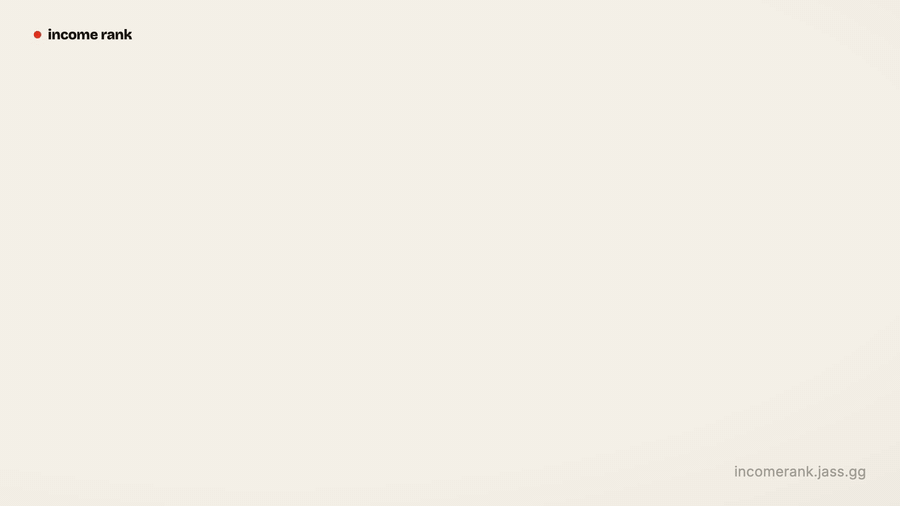

<h1 align="center">income rank</h1>

<p align="center">
  <strong>Find out how rich you actually are.</strong>
</p>

<p align="center">
  Enter what you make, ride the elevator with no top floor, and see exactly where
  your income lands against everyone on Earth.
</p>

<p align="center">
  <a href="https://incomerank.jass.gg"></a>
  <a href="LICENSE"></a>
  
  
</p>

<p align="center">
  <picture>
    <source media="(prefers-reduced-motion: reduce)" srcset="docs/assets/readme/incomerank-header-poster.png">
    
  </picture>
</p>

<p align="center">
  <em>₹50,000/month is the global top 16% — and Elon Musk earns 61&times; that <strong>every day</strong>.</em>
</p>

Your income never touches a server. Every ranking runs **client-side** in your
browser against a static, pre-baked World Bank distribution.

## How It Works

1. You enter a gross income in your local currency + period.
2. It's converted to US dollars at market exchange rates (`income ÷ 365 ÷ FX`).
3. That value is looked up in a population-weighted **world** income distribution
   (your global rank) and in your **country's** distribution (your local rank).
4. A staged reveal animates the climb, then a privacy-safe card/link lets you share
   the result — your rank, never your income.

Every result is a deliberately-labelled **estimate**, and every known bias points
upward (individual-vs-household, gross-vs-net, whole-population denominator). The
methodology and its limits are disclosed in-product behind "how this works" and in
full in [`SOURCES.md`](./SOURCES.md), [`CONTEXT.md`](./CONTEXT.md) and
[`docs/adr/`](./docs/adr).

## The Reveal

The hero is **ASCENT** — income as altitude on a log axis. Everyone on Earth is a
column of dots, densest at the bottom (billions on a few dollars a day) thinning to
a lonely thread in the rich tail. You ride a glass car *up* the shaft; the world
scrolls past; floors are income landmarks (the poverty line, the median person, the
global top 1%). Past your own floor you can keep climbing — flying past MrBeast,
Ronaldo and Swift, all the way to the ceiling, Elon Musk. A procedural Web-Audio
ratchet ticks per notch of travel and machine-guns with speed; a thunk + chime
marks each landing. One pure geometry (`src/lib/tower.ts`) drives the live reveal,
the static `/r/N` share pages, the OG cards and this README's header alike.

## The Data

The displayed rank is **market exchange rate** US dollars per day — the simple
"your salary in dollars vs everyone else's" comparison, with no cost-of-living
adjustment. It covers **165 countries / ~7.9 billion people** (every country with a
2021 exchange rate). The world curve is a population-weighted mixture of per-country
distributions built from the **World Bank Poverty & Inequality Platform (PIP)**,
with a Pareto-fitted upper tail whose *shape* above the top 1% is recalibrated to
the **World Inequality Database (WID.world)**.

Full provenance, licences, vintages and the independent verification table are in
**[`SOURCES.md`](./SOURCES.md)**.

## Stack

- **Astro 6** (`output: 'static'`) + **Tailwind v4** (`@tailwindcss/vite`), TypeScript, Bun.
- The calculator is a plain `<script>` (no framework island) — near-zero shipped JS.
- Data baked to static JSON from World Bank PIP; sound is procedural Web Audio (no assets).
- Share/OG cards pre-rendered at build with **satori + resvg** (path-based `/r/N`).
- Deploys to **Cloudflare Workers Static Assets** (no adapter — [ADR-0002](./docs/adr/0002-static-cloudflare-path-based-og.md)).

## Commands

```bash
bun install
bun run dev      # local dev server
bun run data     # rebuild data JSON from World Bank sources (network; cached)
bun run og       # pre-render OG share cards → public/og/
bun run build    # bun run og && astro build  →  dist/
bun run preview  # serve the production build
bun test         # unit tests for the ranking / parse / copy logic
```

## Data Pipeline

`scripts/build-data.ts` fetches and bakes (downloads cached under `scripts/.cache/`):

- **World Bank PIP** percentiles (dataset 0063646, 2021 PPP) — income distributions.
- **PIP** 2021 PPP factors; **World Bank** population (`SP.POP.TOTL`) and 2021 FX (`PA.NUS.FCRF`).
- **REST Countries** — currency codes; **World Bank** — country names.
- **WID.world** (World pre-tax thresholds, 2021 PPP) — top-tail *shape* above the top 1%.

Each country's CDF is built from its percentile thresholds with a Pareto tail
(α ≈ 2) fit on its well-measured upper-middle, then divided by its price level onto
a market-FX basis; the world CDF is the population-weighted mixture. Output is
validated against published global anchors for the body (Giving What We Can / Our
World in Data, same PIP base) and against WID for the tail shape — see `verify()`.
Generated data (`src/data/`, `public/data/`) is committed so the site builds offline.

## Deploy (Cloudflare)

`jass.gg` must be an active zone on the Cloudflare account.

```bash
bun run build
bunx wrangler deploy   # uploads ./dist, binds incomerank.jass.gg (wrangler.jsonc)
```

## The Demo

The header GIF and the social MP4 are rendered with **Remotion** in
[`remotion/`](./remotion) — a deterministic React composition that reuses the site's
real `tower.ts` geometry and re-synthesizes `sound.ts`'s exact ratchet/landing
voices, so the demo ranks `₹50,000/mo` and sounds exactly like the live site. It
renders two cuts: a silent, CTA-free GIF (the header) and a social MP4 that adds a
call-to-action end card and the sound.

```bash
cd remotion
npm install
npm run render          # audio + both cuts + the GIF, end to end
# …or individually:
bun run audio           # synthesize the soundtrack → public/soundtrack.wav
npm run render:social   # → out/incomerank-social.mp4  (CTA + sound, for socials)
npm run render:hero     # → out/incomerank-hero.mp4    (no CTA, source for the GIF)
npm run gif             # → out/incomerank-hero.gif    (silent, the README header)
npm run studio          # iterate live in the Remotion studio
```

## Attribution

Income distributions from the **World Bank Poverty & Inequality Platform (PIP)** —
the *Percentiles* dataset ([0063646](https://datacatalog.worldbank.org/search/dataset/0063646)),
released under **CC0** (public domain). Population, exchange-rate, PPP-factor and
country data are World Bank Open Data (**CC BY 4.0**); currency codes from REST
Countries. Calibration is cross-checked against Giving What We Can and Our World in
Data; the extreme top tail's shape is calibrated to the World Inequality Database
(**WID.world**). Famous-income figures are rough, cited Forbes/Bloomberg estimates —
see [`SOURCES.md`](./SOURCES.md).

## License

[MIT](LICENSE)
